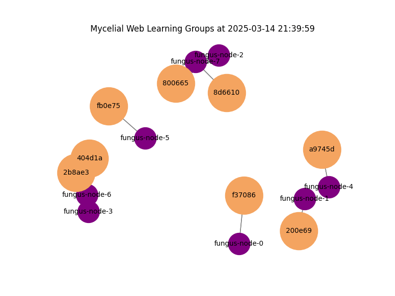

# MyceliumWebServer

## Preview

The mycelium web server can be accessed over its UI to give out song recommendations:


However, that's only on the surface (the fungus fruit so to speak). Underneath, the fungus builds on a complex web of AI agents that collaboratively train AI models:



In the graphic, every fungus node is a running instance of this repository, which together train AI models (mycelium web server and fungus node are in the following used exchangeable).

The fungus nodes communicate over the protocol that builds the Fediverse (ActivityPub); so theoretically, all fungus nodes can be accessed over the Fediverse.
A demo of browsing a mycelium web with two fungus nodes and viewing them from the social web can be seen [here](https://makertube.net/w/doRDfT2ZibYaF9F7EiGCoK).

## Architecture

Currently, a fungus node consists of four parts:

- Fungus-Backend, which contains the core fungus functionality by implementing the SPORE protocol
- ActivityPub-Backend, which manages the communication with other fungus nodes over ActivityPub
- Frontend, which makes the fungus' model available to the user and let's them browse the mycelium web
- A Knowledge Base (in this case Jena Fuseki), which stores the fungus' knowledge and its trained model


# What is the MyceliumWeb?

Chatbots like ChatGPT lie on a centralized server. A federated AI chat bot distributes the learning on multiple PCs, but models are still inside silos. The mycelium goes a step further: here, AI models can freely travel across the web as agents.

It is realized by adding another protocol layer on top of that of federated AI:


More concretely, it realizes the mycelium layer with a protocol that makes use of JavaScript/Python, a communication protocol like AcitivtyPub and evolutionary algorithms.
The concrete implemenation of this is described in the so-called SPORE-protocol.
Based on that, it builds on top of federated, peer-to-peer AI training, e.g. flower.ai and knowledge graphs, which are used to link to other learning groups.


For more background-information about the project's mission statement, see the [Wiki](https://github.com/bluebbberry/MusicRecommendationFungus/wiki).

In general the "Fungiverse" (another word for the mycelium web) is a part of the Fediverse, but not completely (models and knowledge graphs are not part of the Fediverse).
Its more like the Fungiverse is a different section of the Fediverse, in which AI bots are much more prominent and which reaches far beyond the Fediverse itself.

Key difference between fungus actors and usual, human actors in the Fedi/Fungiverse:

- Hashtags are used for collaboration and the implementation of protocols
- Fungus Nodes actors can "merge" themselves by training a model together, which is not possible for human actors (or more broadly speaking: actors with centralized intelligence). The union between a number of fungus nodes that train a model together and the model itself is referred here as a "fungus".

Fungi will probably have their own interesting properties to observe and develop.
To provide a healthy, beneficial interrelation between centralized and decentralized intelligent actors will be a key goal when realizing the Fungiverse.

## Requirements

- Python 3.8+
- Pip (Python package manager)
- Running RDF Knowledge Graph server (e.g., Fuseki)
- Mastodon account + API token

## Setup

### 1. Clone the Repo

```bash
git clone https://github.com/bluebbberry/MyceliumWebServer.git
cd MyceliumWebServer
```

[//]: # (### 2. Install Dependencies)

[//]: # ()
[//]: # (Set up a virtual environment &#40;optional but recommended&#41; and install the dependencies:)

[//]: # ()
[//]: # (```bash)

[//]: # (python3 -m venv venv)

[//]: # (source venv/bin/activate  # Linux/MacOS)

[//]: # (# or)

[//]: # (venv\Scripts\activate     # Windows)

[//]: # ()
[//]: # (pip install -r requirements.txt)

[//]: # (```)

### 2. Configure

- **RDF Knowledge Graph**: Make sure your Fuseki server is running and update the URLs in the .env-file (e.g., `FUSEKI_SERVER_URL`).
- **Mastodon API**: Create a Mastodon API token and setup the connection in the .env-file (`MASTODON_API_KEY`, `MASTODON_INSTANCE_URL`, `ACCOUNT_NAME`).

### 3. Run

[//]: # ()
[//]: # (To start everything, run in the `/src`-folder:)

[//]: # ()
[//]: # (```bash)

[//]: # (python main.py)

[//]: # (```)

[//]: # ()
[//]: # (The system will:)

[//]: # (1. Train the model every five seconds.)

[//]: # (2. Post updates to Mastodon.)

[//]: # (3. Respond to Mastodon requests &#40;e.g., for predictions&#41;.)

[//]: # (4. Share gradients and aggregate other groups' models using the RDF graph to potentially switch groups.)

```bash
docker compose build
docker compose up -d
```

### 4. Interaction with the bot!

Now your system is running, and you can interact with it over the fungi node's frontend, or, if you have set the correct environment-variables, on Mastodon by posting to `#babyfungus`. Ask for recommendations to a song you like and the system will respond.

### 5. Visualize the underlying mycelium web!

The logs of the containers are written to log-files for each container under `./logs`.

With the scripts under `visualization`, you can generate a gif-image from the logs, which displays the interaction between the fungi nodes.

For this, do the following:

1. Copy the logs from ALL log-files under `logs` into ONE log-file called `./logs.json` under `./visualization`
2. Run `python filter_logs.py` to filter the relevant log-entries (the results are written to `filtered_logs.txt`)
3. Execute `python visu.py`, which outputs `animation.gif`

## License

MIT License. See [LICENSE](LICENSE) file for details.
